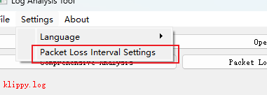
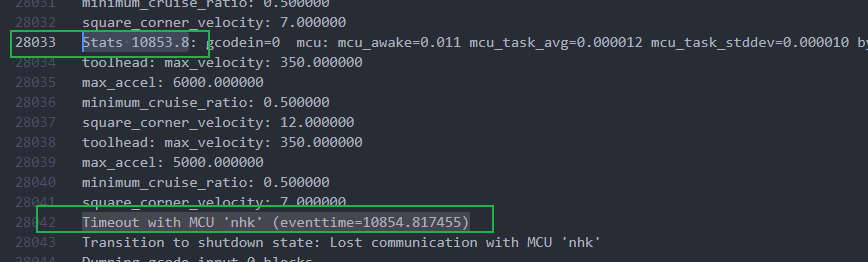

# Installation instructions

## python environment installation

**python installation: Download version 3.9.0**.

**Dependency installation: run pip install -r requirements.txt to install dependent packages**.

**Python run main_view.py to run it **.

## Run it directly (you can download the release file directly to run it)

Unzip the zip file and run AnalyseLog.exe directly.

# Basic operations

## Set analysis interval

You can set the intervals of the x-axis to be analysed. **The results will be different for different intervals, and if you set the interval too large, you may not be able to see some details of the waveforms.**

## Select Hide/Show Line

Click on the target in the way box to choose to hide/show the target line segments

# Related issues

## Meaning of x-axis

The x-axis is the line spacing in the stats file

Its value * sampling interval is the number of lines in the stats file. As shown below 100`*`100=5000, i.e. 50 is the 10000th line in the stats file.

## Determining the moment of disconnection

A spike like the one in the picture below is basically a break.

## Analyse the error for that position in the diagram

Click Packet Loss Analysis to copy an error message

Open the current log and stats files

Search for the error message in the log, find the basis stats before the error, and copy the

Search from the stats file to find the corresponding line as follows

From this, we know that the location of row 9100 is approximately at the following location, as follows (91*100 = 9100)

